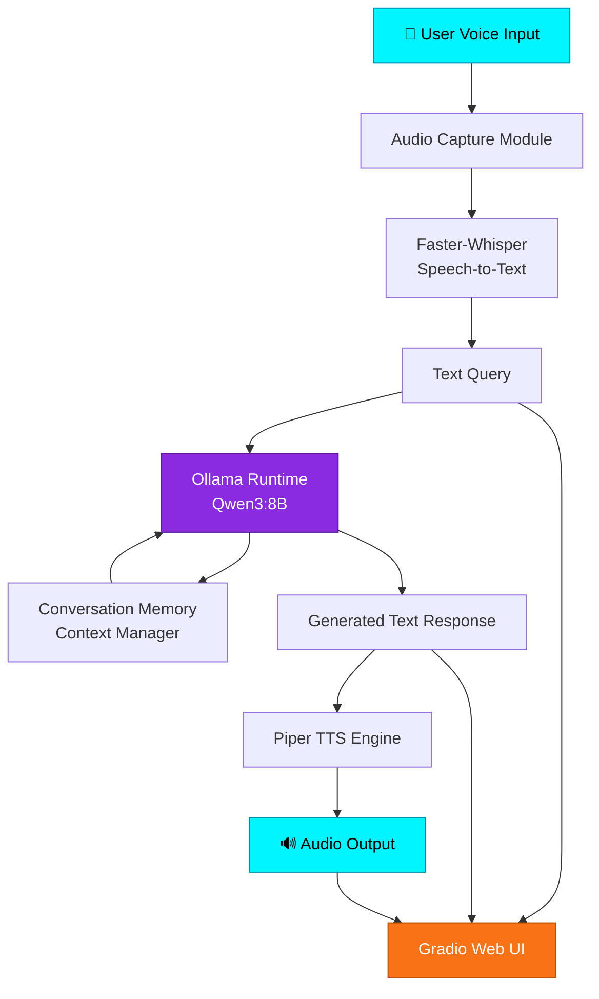
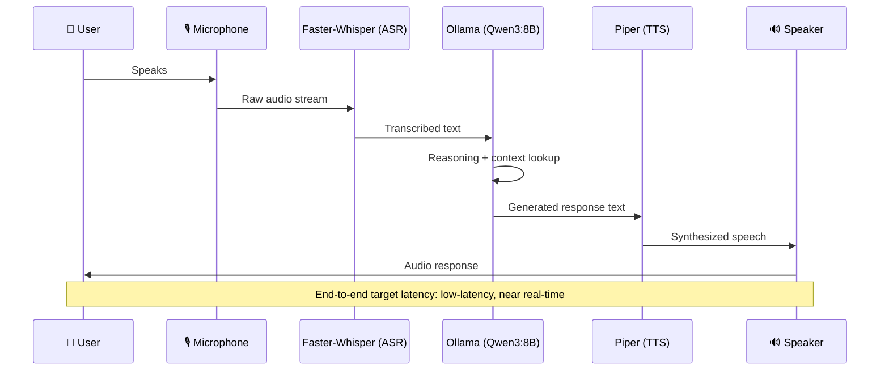
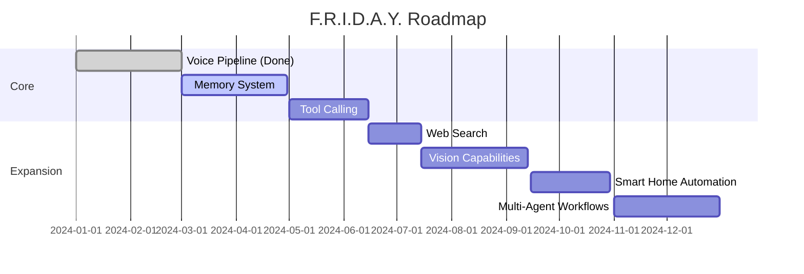

<div align="center">

# 🤖 F.R.I.D.A.Y.
### *Fully Responsive Intelligent Digital Assistant for You*

<!-- 🖼️ INSERT HERO BANNER IMAGE HERE (1280x640 recommended) -->
<!--  -->

**A real-time, offline-first, voice-native AI assistant — inspired by Tony Stark's J.A.R.V.I.S. & F.R.I..A.Y.**

<!-- Animated typing banner placeholder — generate at https://readme-typing-svg.demolab.com -->
<!--  -->

<p>
  
  
  
  
  
</p>

<p>
  
  
  
  
  
</p>

<p>
  <a href="#-demo">Demo</a> •
  <a href="#-key-highlights">Highlights</a> •
  <a href="#-installation">Installation</a> •
  <a href="#-usage">Usage</a> •
  <a href="#-roadmap">Roadmap</a> •
  <a href="#-contributing">Contributing</a>
</p>

</div>

---

## 📖 Overview

**F.R.I.D.A.Y.** is a fully offline, real-time conversational AI assistant that listens, thinks, and speaks — all running locally on your machine. No cloud APIs, no data leaving your device, no latency from network round-trips.

Built from the ground up as a personal engineering challenge, F.R.I.D.A.Y. combines **offline speech recognition**, **local LLM reasoning**, and **offline speech synthesis** into a single low-latency pipeline — wrapped in a clean, interactive web interface.

> *"The goal isn't just a chatbot with a microphone. It's a foundation for a true personal assistant — one that can eventually see, remember, act, and automate."*

### ✨ Why This Project Is Unique

| | |
|---|---|
| 🔒 **100% Offline** | Every component — STT, LLM, TTS — runs locally. Zero API keys, zero cloud dependency, zero data leakage. |
| ⚡ **Low Latency Pipeline** | Engineered audio-to-audio pipeline optimized for near real-time conversation. |
| 🧩 **Modular by Design** | Each component (ASR, LLM, TTS, UI) is swappable — upgrade any piece without rewriting the system. |
| 🛠 **Built for Extension** | Architected from day one to support tool calling, memory, and multi-agent workflows. |
| 🎯 **Real Engineering, Not a Wrapper** | This isn't a thin wrapper around an API — it's a full-stack voice AI system built piece by piece. |

---

## 🚀 Key Highlights

- 🎤 Real-time microphone capture with streaming audio input
- 🧠 Local reasoning powered by **Qwen3:8B** via **Ollama**
- 🗣️ Natural offline text-to-speech using **Piper**
- 💬 Context-aware multi-turn conversations with persistent history
- 🖥️ Clean, responsive **Gradio** web interface (voice + text)
- 🔌 Architecture designed for future tool calling & automation
- 🌐 Fully self-hosted — runs entirely on your own hardware

---

## 🎬 Demo

<!-- 🖼️ INSERT DEMO GIF HERE -->
<!--  -->

<div align="center">
<i>🎥 Full demo video: <a href="#">Watch on YouTube</a> (placeholder link)</i>
</div>

<br>

<details>
<summary>📸 <b>Click to view Screenshots</b></summary>
<br>

<!-- 🖼️ INSERT SCREENSHOT: Gradio Home Interface -->
<!--  -->

<!-- 🖼️ INSERT SCREENSHOT: Live Voice Conversation -->
<!--  -->

<!-- 🖼️ INSERT SCREENSHOT: Text Chat Mode -->
<!--  -->

</details>

---

## 🏗️ Architecture



### 🔄 AI Pipeline Flow



---

## 🧩 Features Grid

<table>
<tr>
<td width="33%" valign="top">

### 🎤 Voice Interaction
- Real-time mic input
- Offline ASR (Faster-Whisper)
- Natural conversation flow
- Low-latency audio pipeline

</td>
<td width="33%" valign="top">

### 🧠 AI Intelligence
- Local inference via Ollama
- Powered by Qwen3:8B
- Persistent conversation history
- Context-aware responses

</td>
<td width="33%" valign="top">

### 🔊 Voice Output
- Offline TTS via Piper
- Natural-sounding synthesis
- Configurable voice profiles
- Low-latency generation

</td>
</tr>
</table>

---

## 🛠 Tech Stack

| Layer | Technology | Purpose |
|---|---|---|
| 🧠 **AI / Reasoning** | [Ollama](https://ollama.com) + **Qwen3:8B** | Local LLM inference & reasoning engine |
| 🎤 **Speech-to-Text** | [Faster-Whisper](https://github.com/SYSTRAN/faster-whisper) | Offline, high-accuracy speech recognition |
| 🔊 **Text-to-Speech** | [Piper](https://github.com/rhasspy/piper) | Fast, natural offline voice synthesis |
| 💻 **Frontend** | [Gradio](https://gradio.app) | Interactive web UI for voice & text |
| 🐍 **Backend** | Python 3.11+ | Core orchestration logic |

### 🔮 Planned Additions

| Technology | Purpose |
|---|---|
| **MCP (Model Context Protocol)** | Standardized tool calling |
| **Gemini** | Multi-model reasoning fallback |
| **LiveKit** | Real-time audio/video streaming infrastructure |
| **FastMCP** | Lightweight MCP server framework |
| **Vector Databases** | Long-term memory & RAG storage |
| **LangChain / LlamaIndex** | RAG orchestration & agent workflows |

---

## 📁 Folder Structure

```
friday/
├── assets/                  # Images, GIFs, diagrams for docs
├── src/
│   ├── audio/
│   │   ├── capture.py        # Microphone input handling
│   │   └── playback.py       # Audio output handling
│   ├── stt/
│   │   └── whisper_engine.py # Faster-Whisper wrapper
│   ├── llm/
│   │   ├── ollama_client.py  # Ollama inference interface
│   │   └── memory.py         # Conversation history/context
│   ├── tts/
│   │   └── piper_engine.py   # Piper TTS wrapper
│   ├── ui/
│   │   └── gradio_app.py     # Gradio web interface
│   └── config.py             # Central configuration
├── tests/                    # Unit & integration tests
├── requirements.txt
├── .env.example
├── LICENSE
└── README.md
```

---

## ⚙️ Installation

### Prerequisites

- 🐍 Python 3.11+
- 🖥️ [Ollama](https://ollama.com) installed and running
- 🎧 A working microphone and speaker

### Steps

```bash
# 1️⃣ Clone the repository
git clone https://github.com/yourusername/friday.git
cd friday

# 2️⃣ Create a virtual environment
python -m venv venv
source venv/bin/activate   # Windows: venv\Scripts\activate

# 3️⃣ Install dependencies
pip install -r requirements.txt

# 4️⃣ Pull the LLM model via Ollama
ollama pull qwen3:8b

# 5️⃣ Download Piper voice model
# (see /assets/voices or Piper docs for available voices)

# 6️⃣ Run the application
python src/ui/gradio_app.py
```

<details>
<summary>🐳 <b>Docker Setup (optional)</b></summary>

```bash
docker build -t friday-assistant .
docker run -p 7860:7860 friday-assistant
```

</details>

---

## ▶️ Usage

Once running, open your browser at:

```
http://localhost:7860
```

- 🎤 Click the **microphone icon** to speak naturally
- ⌨️ Or type your query in the **text input box**
- 🔊 F.R.I.D.A.Y. will respond with synthesized speech + text
- 🕓 Conversation history is maintained automatically for context

---

## 🔧 Configuration

All configuration lives in `src/config.py` / `.env`:

```env
# LLM Settings
OLLAMA_MODEL=qwen3:8b
OLLAMA_HOST=http://localhost:11434

# Speech-to-Text
WHISPER_MODEL_SIZE=base
WHISPER_DEVICE=cpu   # or cuda

# Text-to-Speech
PIPER_VOICE=en_US-amy-medium

# UI
GRADIO_SERVER_PORT=7860
```

---

## 💬 Example Conversations

<details>
<summary>Click to expand example interaction</summary>

```
👤 User: Hey FRIDAY, what's the weather like for coding today?
🤖 FRIDAY: I don't have live weather access yet, but I can already tell
           your coding forecast: 100% chance of debugging! Web search
           integration is coming in a future update.

👤 User: Remind me what we discussed earlier about the architecture.
🤖 FRIDAY: We talked about your audio pipeline — mic input feeding into
           Faster-Whisper for transcription, then Qwen3:8B for reasoning,
           and Piper for the voice response.
```

</details>

---

## 📊 Benchmarks & Performance

> ⚠️ *Placeholder — populate with real measurements on your target hardware.*

| Metric | Value |
|---|---|
| 🎤 ASR Latency (avg) | `_____ ms` |
| 🧠 LLM Response Time (avg) | `_____ ms` |
| 🔊 TTS Generation Time (avg) | `_____ ms` |
| ⚡ End-to-End Latency | `_____ ms` |
| 💾 RAM Usage (idle) | `_____ GB` |
| 💾 RAM Usage (active inference) | `_____ GB` |
| 🖥️ Tested On | `CPU / GPU model here` |

---

## 🗺 Future Roadmap

- [ ] 🧠 Long-term memory system
- [ ] 🌐 Web search integration
- [ ] 🛠 Tool calling / function execution
- [ ] 📅 Calendar integration
- [ ] 📧 Email assistant capabilities
- [ ] 💬 WhatsApp integration
- [ ] 👁️ Vision capabilities (image/screen understanding)
- [ ] 🏠 Smart home automation
- [ ] 📚 RAG-based knowledge retrieval
- [ ] 🤝 Multi-agent workflows



---

## 🧗 Challenges Faced

- ⚡ **Latency optimization** — Chaining three real-time systems (ASR → LLM → TTS) without introducing noticeable lag required careful tuning of buffering and streaming.
- 🎙️ **Audio pipeline stability** — Handling microphone edge cases (background noise, silence detection, interruptions) reliably across platforms.
- 🧠 **Context management** — Balancing conversation history length against local LLM context window limits.
- 🔧 **Offline-first constraints** — Every capability had to work without internet access, which ruled out many common cloud-based shortcuts.

## 📚 What I Learned

- Building a real-time, multi-stage AI pipeline end-to-end from raw audio to synthesized speech
- Practical tradeoffs between local model size, latency, and response quality
- Designing modular architecture that anticipates future features (memory, tools, agents)
- Deep hands-on experience with offline ASR/TTS systems and local LLM orchestration

---

## 🤝 Contributing

Contributions, issues, and feature requests are welcome!

1. 🍴 Fork the repository
2. 🌿 Create your feature branch (`git checkout -b feature/amazing-feature`)
3. 💾 Commit your changes (`git commit -m 'Add amazing feature'`)
4. 🚀 Push to the branch (`git push origin feature/amazing-feature`)
5. 🔁 Open a Pull Request

Please check the [issues page](../../issues) for open tasks before starting.

---

## 📄 License

This project is licensed under the **MIT License** — see the [LICENSE](LICENSE) file for details.

---

## 📸 Screenshots


---
## 👤 Author

<div align="center">

**R Sanjay**

<!-- 🖼️ INSERT PROFILE/AVATAR IMAGE HERE -->
[](https://github.com/sanjay7978)
[](https://www.linkedin.com/in/r-sanjay-561805374/)

</div>

---

## ⭐ Star the Repository

<div align="center">

If you found this project interesting or useful, please consider giving it a ⭐ —
it genuinely helps and keeps the motivation going for building out the full roadmap.


**Made with ❤️, ☕, and a lot of debugging by [R Sanjay]**

</div>
